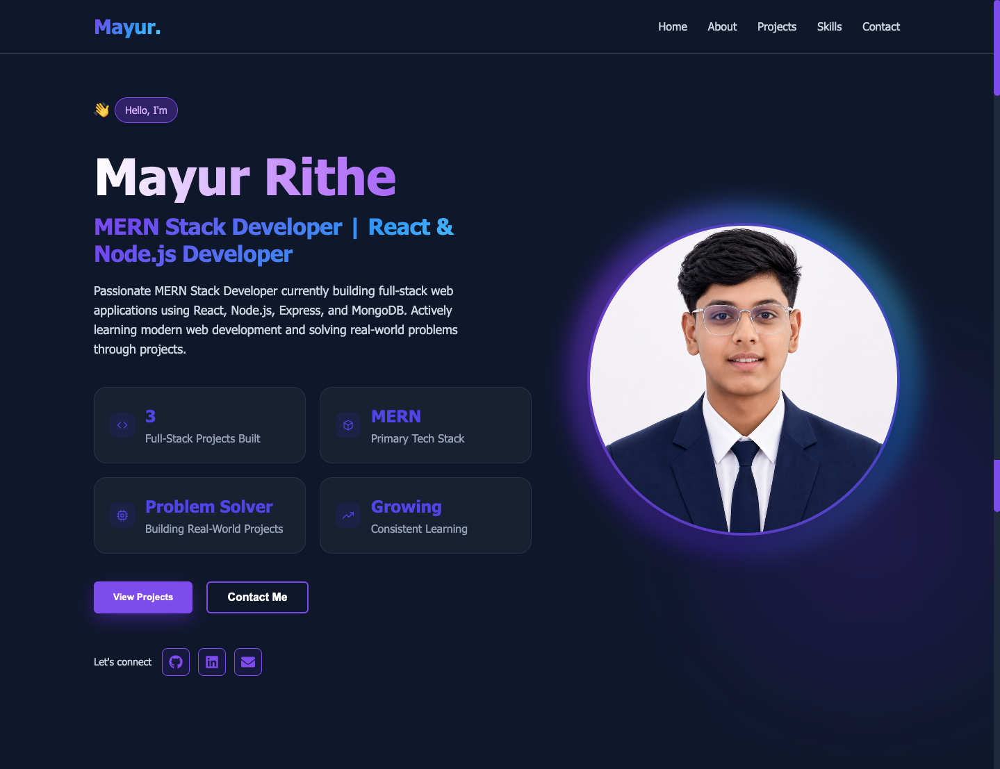
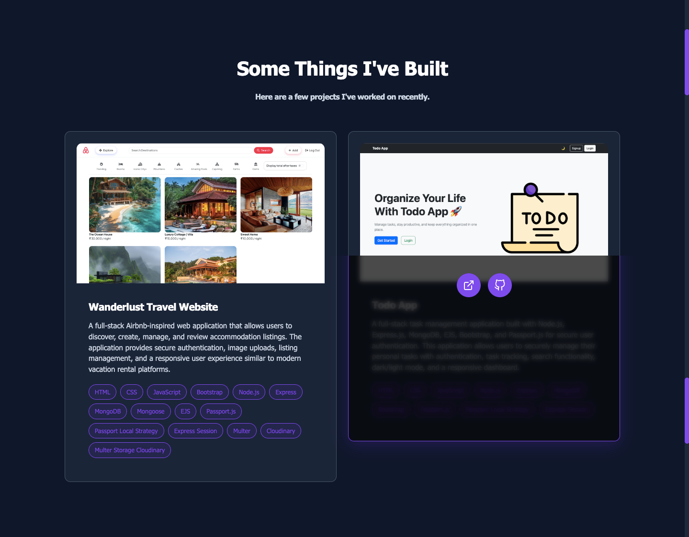
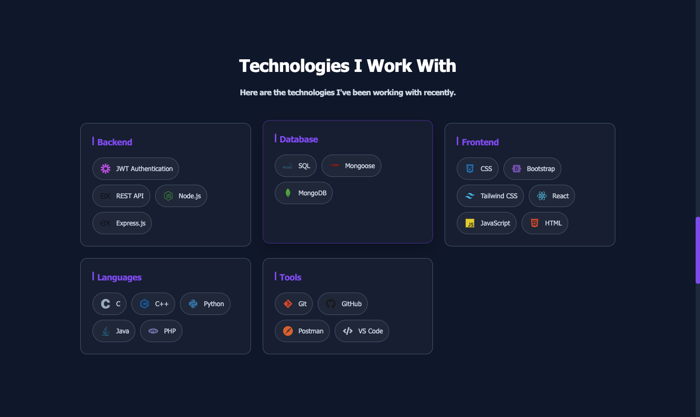
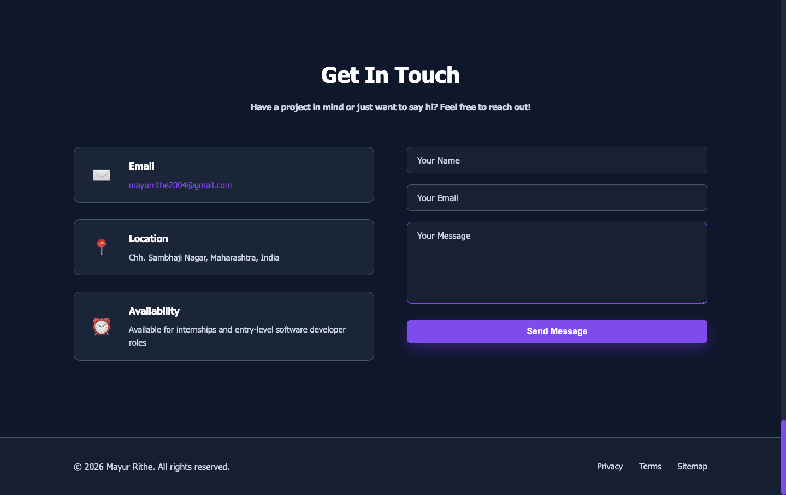

# 🚀 Personal Portfolio Website

A modern full-stack portfolio website built with the MERN stack to showcase my projects, technical skills, and web development journey.

## 🌐 Live Demo

🔗 Live Website: https://personal-portfolio-1-cqic.onrender.com

---

## 📖 Overview

This portfolio website serves as a central place to showcase my development work, technical skills, and contact information. It features a responsive user interface, dynamic project management, skills categorization, and a backend API powered by Node.js, Express, and MongoDB.

---

## ✨ Features

- Responsive and modern user interface
- Dynamic Projects Section
- Skills Showcase with Technology Icons
- Contact Form Integration
- MongoDB Database Integration
- RESTful API Architecture
- Mobile-Friendly Design
- Clean Component-Based Structure
- Project Screenshot Support
- Easy Content Management with Database Seeding

---

## 🛠️ Tech Stack

### Frontend

- React.js
- JavaScript (ES6+)
- CSS3
- React Icons
- Vite

### Backend

- Node.js
- Express.js

### Database

- MongoDB
- Mongoose

### Development Tools

- Git
- GitHub
- VS Code
- Postman

**Email Service**
- Resend (for contact form emails)

---

## 📂 Project Structure

```text
portfolio-website
│
├── client
│   ├── public
│   │   └── images
│   │
│   ├── src
│   │   ├── assets
│   │   ├── components
│   │   ├── App.jsx
│   │   ├── main.jsx
│   │   └── index.css
│   │
│   ├── package.json
│   └── vite.config.js
│
├── server
│   ├── config
│   ├── controllers
│   ├── models
│   ├── routes
│   ├── seeder.js
│   ├── server.js
│   └── package.json
│
└── README.md
```

---

## 📸 Screenshots

Add screenshots of your portfolio here.

### Home Section



### Projects Section



### Skills Section



### Contact Section



---

## 🚀 Getting Started

### Clone the Repository

```bash
git clone https://github.com/Mayur-Rithe-14/portfolio-website.git
```

### Install Frontend Dependencies

```bash
cd client
npm install
```

### Install Backend Dependencies

```bash
cd ../server
npm install
```

### Configure Environment Variables

Create a `.env` file inside the `server` folder:

```env
PORT=5000
MONGODB_URI=your_mongodb_connection_string
```

### Seed Database

```bash
node seeder.js
```

### Start Backend Server

```bash
npm start
```

### Start Frontend Application

```bash
cd ../client
npm run dev
```

---

## 📡 API Endpoints

### Projects

```http
GET /api/projects
```

### Skills

```http
GET /api/skills
```

### Contact

```http
POST /api/contact
```

---

## 🎯 Future Enhancements

- Dark / Light Theme Toggle
- Resume Download Feature
- Admin Dashboard
- Project Filtering
- Blog Section
- Advanced Animations
- Performance Optimization
- Deployment Automation

---

## 👨‍💻 Author

**Mayur Rithe**

GitHub: https://github.com/Mayur-Rithe-14

Email: [mayurrithe2004@gmail.com](mailto:mayurrithe2004@gmail.com)

---

## ⭐ Support

If you like this project, consider giving it a star on GitHub.

---

## 📄 License

This project is licensed under the MIT License.
